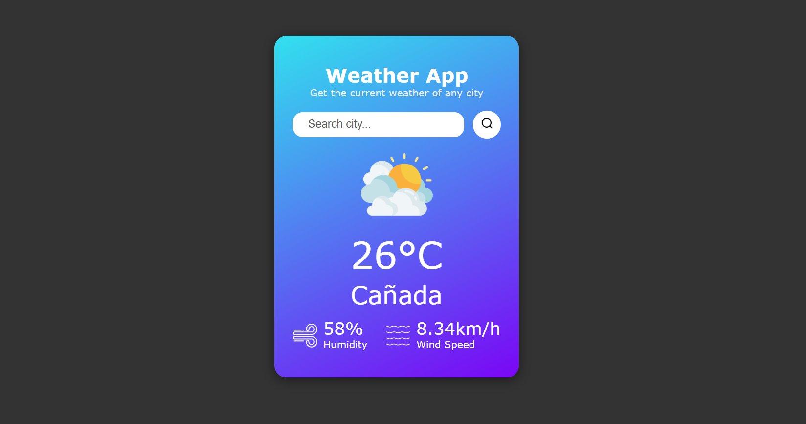

# 🌦️ Weather App using JavaScript

A clean, minimal, and responsive Weather App built using **HTML**, **CSS**, and **JavaScript** that fetches real-time weather data using the [OpenWeatherMap API](https://openweathermap.org/api). Type in a city and instantly get current temperature, weather condition, humidity, and wind speed.

---

## 🔗 Live Demo

👉 [View Live Website](https://rohan-rccodes.github.io/weather-app/)
  
📸 Preview:



---

## ✨ Features

- 🌍 Real-time weather updates by city name  
- ☀️ Displays temperature, humidity, and wind speed  
- 🎯 Custom weather icons based on condition  
- ⚠️ Invalid city error handling  
- 📱 Fully responsive across all devices  
- 🔔 Beautiful animated custom alert messages

---

## 🛠️ Tech Stack

| Technology | Purpose |
|------------|---------|
| HTML       | Page structure |
| CSS        | Styling & layout |
| JavaScript | Logic & API calls |
| OpenWeatherMap API | Weather data |

---

## 📁 Folder Structure

📦 weather-app/

├── 📄 index.html

├── 🎨 style.css

├── 📜 script.js

├── 📁 images/

│ ├── clouds.png

│ ├── clear.png

│ ├── drizzle.png

│ ├── rain.png

│ ├── snow.png

│ ├── mist.png

│ ├── wind.png

│ ├── humidity.png

│ ├── search.png

│ └── preview.png


---

## 🖥️ Setup Instructions

1. Clone the repository:
   ```bash
   git clone https://github.com/Rohan-rccodes/weather-app-JS.git

2. Navigate to the project directory:

    cd weather-app

3. Open index.html in your browser OR launch using Live Server.

4. Replace the apikey in script.js with your OpenWeatherMap API key.

---

💡 How it Works
The search input captures city names.

On button click, fetch() sends a request to OpenWeatherMap.

The weather info is shown or error is displayed.

Custom alert system gives feedback (styled with CSS animations).

Fully mobile-optimized with media queries.

---

🙏 Credits
Weather icons from OpenWeatherMap and Flaticon

Live API from OpenWeatherMap

---

📜 License
This project is licensed under the MIT License.

--- 

Designed & developed with ❤️ by Rohan aka rccodes
